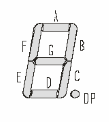
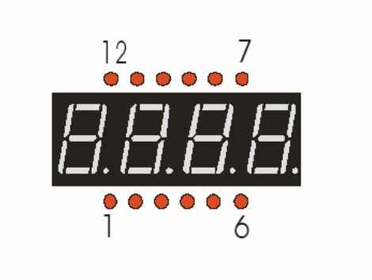
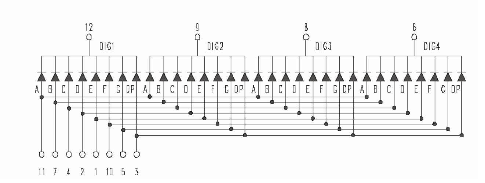
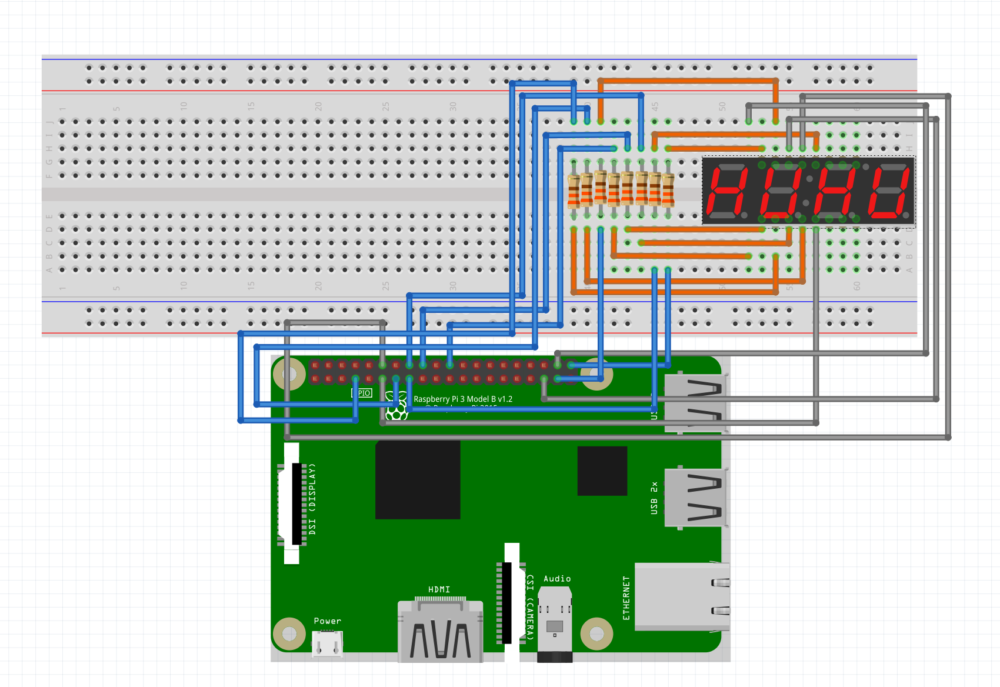
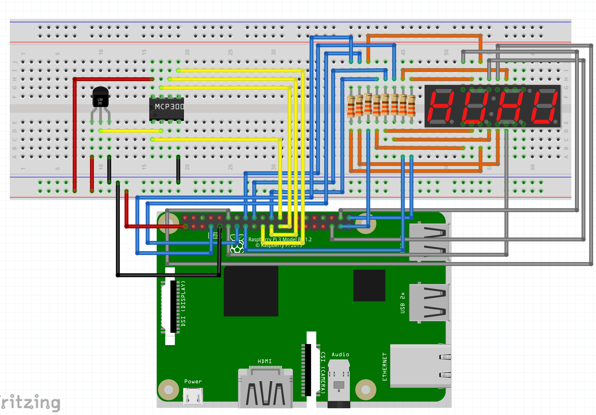
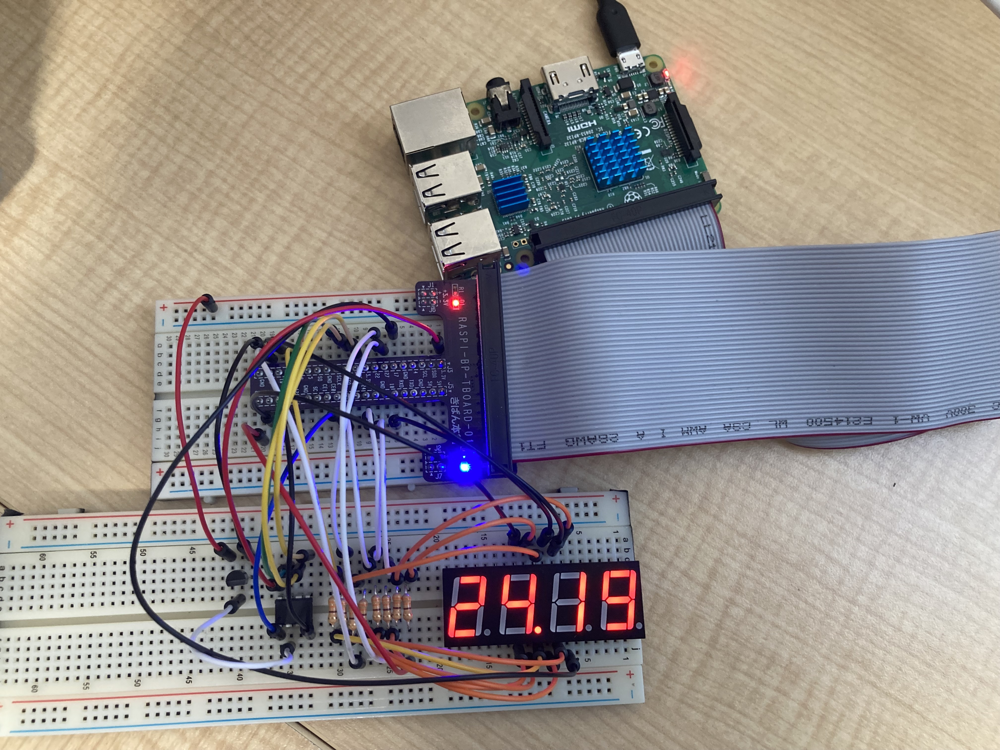

今回はRaspberryPiで温度センサーで取得した値を7セグ表示器に表示してみたい。

温度センサーで温度を取得するのは以前、記事に書いています。

https://qiita.com/ktamido/items/937712efa5c2640eb472

# ■ 利用する部品

## OSL40562-LRA 

[OSL40562-LRA データシート](https://akizukidenshi.com/download/OSL40562-LRA.pdf)

### 基本情報

- 順電圧(VF) : 2.1V
- 順電流(IF) (絶対最大定格): 20mA


### ピン

7セグ表示器は、7つのセグメント(+ドット)にそれぞれGPIOを割り当て、HIGHで表示・LOWで非表示というように表示を切り替える。



4桁の7セグ表示器のピンは12本。  
一桁でドットも含めて8つのGPIOの割当が必要であれば、4桁だと最低32本必要なのでは？と思うが、この7セグ表示器では一桁ずつ点灯・消灯を高速で繰り返すことによって見た目上4桁表示できる **ダイナミック制御** を利用する。




11, 7, 4, 2, 1, 10, 5, 3ピンがセグの表示を制御するアノード側のピン。
12, 9, 8, 6 はカソード側のピン。

この表示器は **カソードコモン** なので、カソード側のピンは各桁ごとに一つとなっている。

アノード側のピンをHIGH、カソード側のピンをLOWに設定することで、指定したセグメントが点灯する仕組み。




# ■ 作るもの (その1)

ひとまず、どんな感じで実装すれば動くのかを試してみたいので、単純に数を0.1ずつカウントアップするプログラムを実装してみる。

## 回路図

- アノード側
  - 11pin(セグメントA): GPIO 21
  - 7pin (セグメントB): GPIO 22
  - 4pin (セグメントC): GPIO 23
  - 2pin (セグメントD): GPIO 24
  - 1pin (セグメントE): GPIO 25
  - 10pin(セグメントF): GPIO 26
  - 5pin (セグメントG): GPIO 27
  - 3pin (セグメントDP): GPIO 6
- カソード側
  - 12pin(1桁目): GPIO 17
  - 9pin (2桁目): GPIO 18
  - 8pin (3桁目): GPIO 19
  - 6pin (4桁目): GPIO 20

抵抗はすべて330Ω。



### 実装

7セグ表示器の表示は常に高速でループを回しているため、カウントをインクリメントすることができない。  
なので、今回はは `concurrent.futures` を利用して「7セグ表示器の表示 (`display関数`)」と「カウントのインクリメント (`counter関数`)」を別スレッドで行っている。 (これしか思い浮かばなかったが、もっといいやり方はあるのだろうか)

当然、counter関数でカウントアップした値をdisplay関数から参照できなければならないので、 `data = [0, 0, 0, 0]` という、各桁に表示する情報を管理するオブジェクトをそれぞれのスレッドで共有している。


あと、個人的にこだわったポイントは `-999 ~ 9999` まで、少数を含めて表示できるようにしたところだ。  
[TC4511BP](https://www.marutsu.co.jp/contents/shop/marutsu/datasheet/TC4511B.pdf) のような7セグ表示器ドライバーを使うと 1 ~ 9 までしか表示できず、マイナス値や少数を表現できない。

こんな感じで、第一引数の `float` で `data` を更新する関数を実装してみた。

```python
def refresh(f: float, data: list[int]):
    # -999 ~ 9999
    data_len = len(data)
    # 整数部と少数部に分割
    ip, fp = str(round(float(f), 3)).split(".")
    # 小数部は整数部と合わせて4桁になるように調整
    fp = fp[:data_len - len(ip)].ljust(data_len - len(ip), "0")
    idx = 0
    # dataに整数部の表示情報を格納していく
    for e in ip:
        data[idx] = SEG_SHAPE[e]
        idx = idx + 1
    if idx == 4:
        return ip # 小数部がなければそのまま返却
    data[idx - 1] = data[idx - 1] | 1 << 7 # 小数点を付与
    # dataに少数部の表示情報を格納していく
    for e in fp:
        data[idx] = SEG_SHAPE[e]
        idx = idx + 1
    return f"{ip}.{fp}"

```

実装全体はこんな感じ。


```python:counter.py
from concurrent.futures import ThreadPoolExecutor
import time
import pigpio

# 点灯するセグメントを表す
SEG_SHAPE = {
    # g -> aの順 (1が表示セグ, 0が非表示セグ。ドットは含まない)
    "0":  0b0111111,
    "1":  0b0000110,
    "2":  0b1011011,
    "3":  0b1001111,
    "4":  0b1100110,
    "5":  0b1101101,
    "6":  0b1111101,
    "7":  0b0000111,
    "8":  0b1111111,
    "9":  0b1101111,
    "-":  0b1000000,
    "E":  0b1111001,
    "A":  0b1110111,
    "C":  0b0111001,
    " ":  0b0000000,
    "":   0b0000000,
}

# 7セグ表示を制御するGPIO (a -> gの順)
SEG_GPIO = [21, 22, 23, 24, 25, 26, 27]
# "." 表示を制御するGPIO
DP_GPIO = 6
# 表示する桁を制御するGPIO (4桁目 -> 1桁目 の順)
DIGIT_GPIO = [20, 19, 18, 17]


def display(pi, data: list[int]):
    """ダイナミック制御で4桁の7セグを表示する関数"""
    while True:
        # 各桁を順番に高速で点灯させることで全桁表示しているように見せる
        for digit, seg_shape in enumerate(data):
            ############################
            # 点灯
            ############################
            # カソード側: LOWに設定
            pi.write(DIGIT_GPIO[digit], 0)

            # アノード側(7セグ表示): (点灯するセグメントに対応するGPIOをHIGHに設定)
            for i in range(0, 7):
                pi.write(SEG_GPIO[i], (seg_shape >> i) & 1)
            # アノード側(ドット表示): (最上位ビットが1ならドットに対応するGPIOをHIGHに設定)
            pi.write(DP_GPIO, (seg_shape >> 7) & 1)
            time.sleep(0.001)

            ############################
            # 消灯
            ############################
            # アノード側: すべてのGPIOをLOWに設定
            for i in SEG_GPIO:
                pi.write(i, 0)
            pi.write(DP_GPIO, (seg_shape >> 7) & 0)

            # カソード側: HIGHに設定
            pi.write(DIGIT_GPIO[digit], 1)


def counter(data: list[int]):
    """表示する数字をインクリメントする関数"""
    cnt = -110
    while cnt < 10000:
        time.sleep(0.1)
        cnt = round(cnt, 2) + 0.1
        ret = refresh(cnt, data)
        print(f"{cnt}: '{ret}', {[bin(i) for i in data]}")


def refresh(f: float, data: list[int]):
    # -999 ~ 9999
    data_len = len(data)
    ip, fp = str(round(float(f), 3)).split(".")
    fp = fp[:data_len - len(ip)].ljust(data_len - len(ip), "0")
    idx = 0
    for e in ip:
        data[idx] = SEG_SHAPE[e]
        idx = idx + 1
    if idx == 4:
        return ip
    data[idx - 1] = data[idx - 1] | 1 << 7 # 小数点を付与
    for e in fp:
        data[idx] = SEG_SHAPE[e]
        idx = idx + 1
    return f"{ip}.{fp}"


def init_gpio(pi):
    """gpioをリセットす関数"""
    for gpio in SEG_GPIO:
        pi.write(gpio, 0)
    for gpio in DIGIT_GPIO:
        pi.write(gpio, 1)


def main():
    pi = pigpio.pi()
    if not pi.connected:
        raise Exception("pigpio connection faild...")

    # すべてのGPIOをOUTPUTに設定
    for gpio in SEG_GPIO + DIGIT_GPIO:
        pi.set_mode(gpio, pigpio.OUTPUT)

    # GPIOの初期化
    init_gpio(pi)
    # カウンターと表示は別スレッドで動かす
    with ThreadPoolExecutor(max_workers=2) as executor:
        data = [0, 0, 0, 0]  # 各桁の点灯するセグメントがbitで格納される(displayとtaskの共有データ)
        display_future = executor.submit(display, pi, data)
        counter_future = executor.submit(counter, data)
        try:
            counter_future.result()
            display_future.result()
        finally:
            init_gpio(pi)
            pi.stop()
            print("[INFO] GPIO close.")


if __name__ == "__main__":
    main()
```

とりあえず動いた。


# ■ 作るもの (その2)

さて、数だけ表示しても意味がないので、前回作った温度センサーから取得した値を表示できるように改修していく。

## 回路図

7セグ表示器側の配線は同様である。

A/Dコンバーターと温度センサーの配線は前回の記事を参照。

https://qiita.com/ktamido/items/937712efa5c2640eb472




## 実装

基本的には、 `counter関数` を温度センサーから温度を取得する `task関数` に書き換えただけである。


```python:temp_sensor.py
from concurrent.futures import ThreadPoolExecutor
import time
import pigpio

# 点灯するセグメントを表す
SEG_SHAPE = {
    # g -> aの順
    "0":  0b0111111,
    "1":  0b0000110,
    "2":  0b1011011,
    "3":  0b1001111,
    "4":  0b1100110,
    "5":  0b1101101,
    "6":  0b1111101,
    "7":  0b0000111,
    "8":  0b1111111,
    "9":  0b1101111,
    "-":  0b1000000,
    "E":  0b1111001,
    "A":  0b1110111,
    "C":  0b0111001,
    " ":  0b0000000,
    "":   0b0000000,
}

# 7セグ表示を制御するGPIO (a -> gの順)
SEG_GPIO = [21, 22, 23, 24, 25, 26, 27]
# "." 表示を制御するGPIO
DP_GPIO = 6
# 表示する桁を制御するGPIO (4桁目 -> 1桁目 の順)
DIGIT_GPIO = [20, 19, 18, 17]

def display(pi, data: list[int]):
    """ダイナミック制御で4桁の7セグを表示する関数"""
    while True:
        # 各桁を順番に高速で点灯させることで全桁表示しているように見せる
        for digit, seg_shape in enumerate(data):
            ############################
            # 点灯
            ############################
            # カソード側: LOW
            pi.write(DIGIT_GPIO[digit], 0)

            # アノード側(7セグ表示): (点灯するセグメントに対応するGPIOをHIGHにする)
            for i in range(0, 7):
                pi.write(SEG_GPIO[i], (seg_shape >> i) & 1)

            # アノード側(ドット表示): (最上位ビットが1ならドットに対応するGPIOをHIGHにする)
            pi.write(DP_GPIO, (seg_shape >> 7) & 1)

            time.sleep(0.001)

            ############################
            # 消灯
            ############################
            # アノード側: すべてのGPIOをLOWにする
            for i in SEG_GPIO:
                pi.write(i, 0)
            pi.write(DP_GPIO, (seg_shape >> 7) & 0)

            # カソード側: HIGH
            pi.write(DIGIT_GPIO[digit], 1)

def task(pi, spi_handler, data: list[int]):
    VREF = 3.3  # A/Dコンバータの基準電圧
    CHANNEL = 0  # MCP3002のCH0端子,CH1端子どちらを利用するか
    while True:
        # 1bit: 0固定
        # 2bit: スタートビット (1固定)
        # 3bit: SGL/DIFF: 動作モード。疑似差動モード(0)、シングルエンドモード(1)
        # 4bit: ODD/SIGN: MCP3002で利用するチャンネル。 CH0(0), CH1(1)
        # 5bit: MSBF: 受信データの形式。MSBF + LSBF(0), MSBFのみ(1)、
        write_data = 0b0110100000000000
        write_data = write_data | (0b1 * CHANNEL) << 12  # ODD/SIGN: 入力されたチャンネルで設定
        write_data = write_data.to_bytes(2, "big")
        cnt, read_data = pi.spi_xfer(spi_handler, write_data)
        if cnt != 2:
            print("[error] skip.")
            continue
        value = int.from_bytes(read_data, "big") & 0b1111111111  # 10ビットを値として取り出す
        volt = (value / 1023.0) * VREF  # 温度センサーから入力された電圧
        temp = (volt - 0.6) / 0.01  # 電圧を温度に変換。(0℃で600mV , 1℃につき10mV増減)
        refresh(temp, data)
        print(f"value: {value}, volt: {volt}, temp: {temp}")
        time.sleep(3)

def refresh(f: float, data: list[int]):
    # -999 ~ 9999
    data_len = len(data)
    ip, fp = str(round(float(f), 3)).split(".")
    fp = fp[:data_len - len(ip)].ljust(data_len - len(ip), "0")
    idx = 0
    for e in ip:
        data[idx] = SEG_SHAPE[e]
        idx = idx + 1
    if idx == 4:
        return ip
    data[idx - 1] = data[idx - 1] | 1 << 7 # 小数点を付与
    for e in fp:
        data[idx] = SEG_SHAPE[e]
        idx = idx + 1
    return f"{ip}.{fp}"

def init_gpio(pi):
    """gpioをリセットす関数"""
    for gpio in SEG_GPIO:
        pi.write(gpio, 0)
    for gpio in DIGIT_GPIO:
        pi.write(gpio, 1)

def main():

    pi = pigpio.pi()
    if not pi.connected:
        raise Exception("pigpio connection faild...")

    # SPIオープン
    CHIP_SELECT = 0  # ラズパイの CE0端子, CE1端子どちらに接続するか
    SPI_MODE = 0b00  # SPIモード0を設定。アイドル時のクロックはLOW(CPOL=0)、クロックがHIGHになるときにデータをサンプリング(CPHA=0)
    OPTION = 0b0 | SPI_MODE
    CLOCK_SPEED = 50000  # 50KHz
    spi_handler = pi.spi_open(CHIP_SELECT, CLOCK_SPEED, OPTION)

    # すべてのGPIOをOUTPUTに設定
    for gpio in SEG_GPIO + DIGIT_GPIO:
        pi.set_mode(gpio, pigpio.OUTPUT)

    # GPIOの初期化
    init_gpio(pi)
    # 温度測定とディスプレイ表示は別スレッドで動かす
    with ThreadPoolExecutor(max_workers=2) as executor:
        data = [0, 0, 0, 0]  # 各桁の点灯するセグメントがbitで格納される(displayとtaskの共有データ)
        display_future = executor.submit(display, pi, data)
        counter_future = executor.submit(task, pi, spi_handler, data)
        try:
            counter_future.result()
            display_future.result()
        finally:
            pi.spi_close(spi_handler)
            init_gpio(pi)
            pi.stop()
            print("[INFO] GPIO close.")


if __name__ == "__main__":
    main()

```

うごいた！！

