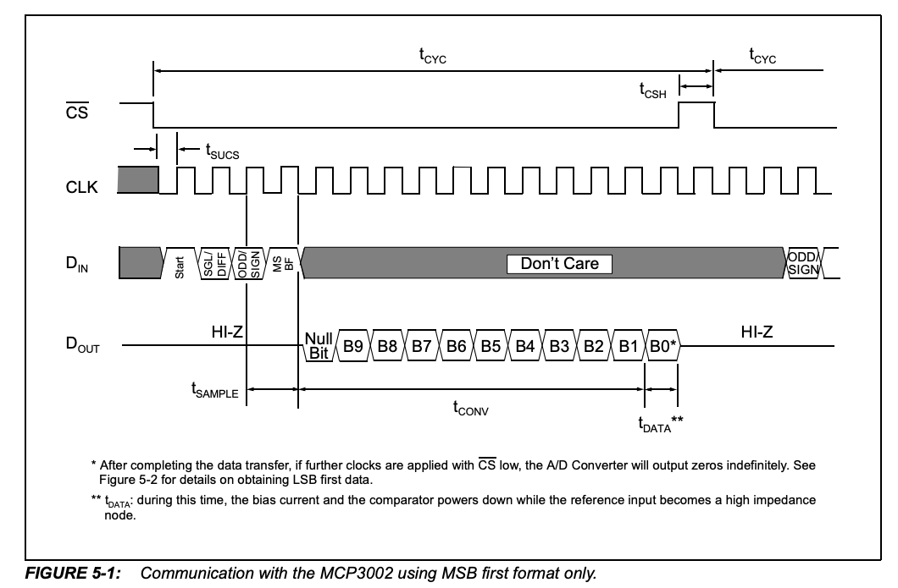
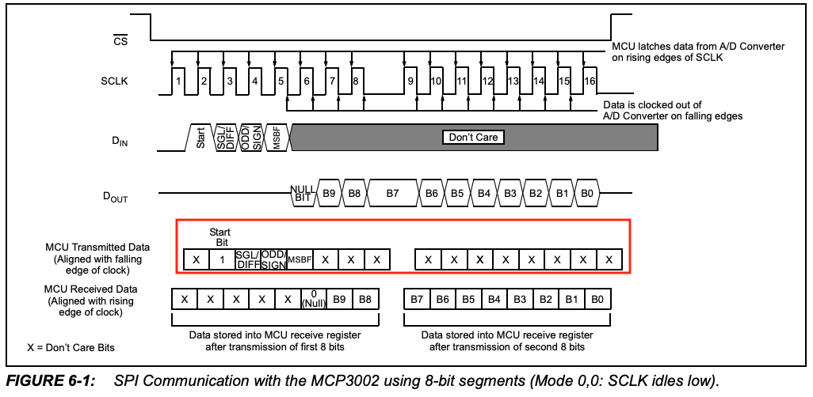
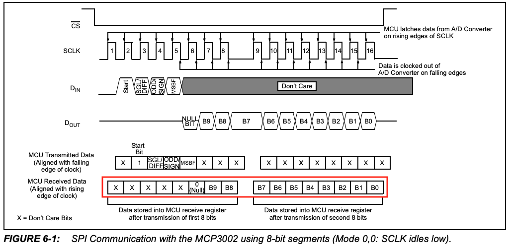
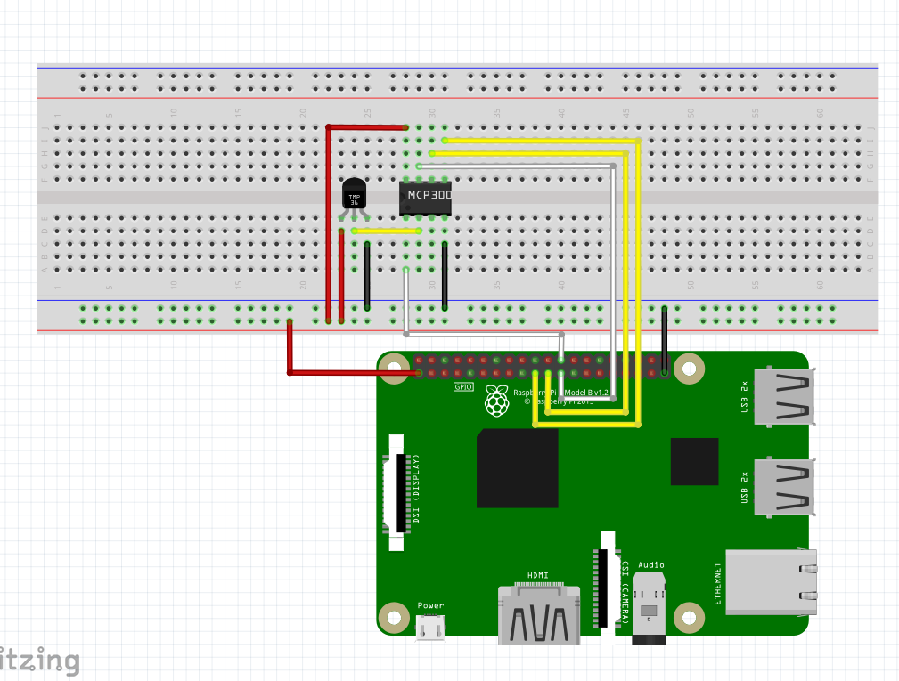
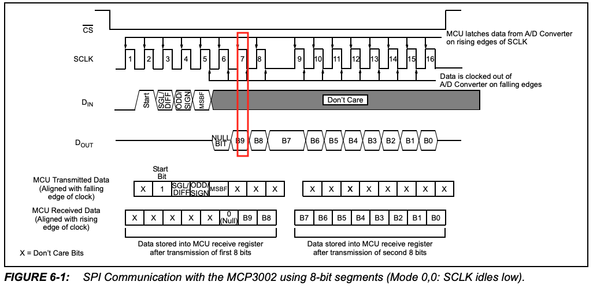

# ■ 作るもの

アナログ温度センサーとA/Dコンバータを利用した室温測定器

# ■ 利用する部品

## MCP3002

10Bit A/Dコンバーター (SPI: Serial Peripheral Interface)

[データシート](https://akizukidenshi.com/download/ds/microchip/mcp3002.pdf)

### 基本情報

- 分解能: 10bit
- 電源電圧: 2.7V ~ 5V
- SPI: モード0とモード3が利用可能
- 最大サンプリングレート 200ksps(5V), 75ksps(2.7V)

### ピン

```
VDD/VREF CLK DOUT DIN
 --------------------
| )  MCP3002        |
 --------------------
CS/SHDN  CH0 CH1  VSS
```

1. CS/SHDN :ラズパイのCE0(CE1)端子に接続  
    - 通信時にMCP3002からラズパイのCE0(CE1)端子をLOWに設定する
1. CH0: アナログデバイスの出力端子に接続  
    - アナログデバイスの出力電圧を受け取る
1. CH1: アナログデバイスの出力端子に接続  
    - アナログデバイスの出力電圧を受け取る  
1. VSS: ラズパイのGND端子に接続  
1. DIN: ラズパイのMISO(Master In Slave Out)端子に接続  
    - ラズパイからMCP3002へのデータ入力  
1. DOUT: ラズパイのMOSI(Master Out Slave In)端子に接続  
    - MCP3002からラズパイへのデータ入力  
1. CLK: ラズパイのSCKL(シリアルクロック)端子に接続  
    - 通信するデバイス同士のタイミング合わせで利用
1. VDD/VREF: ラズパイの3.3V端子に接続  
    - 電源/基準電圧入力 (2.7V~5.5V)

### データの送受信

送信するデータは2バイトで、受信するデータも2バイト。受信データはMSBファーストフォーマットで受け取ることができる。(オプションでLSBファーストフォーマットでの受け取りも可能らしい。)
今回はMSBファーストフォーマットでのみデータを受信する方式を利用する。

データシートを確認すると、データの送受信の図があったので見方をざっくり調べてみた。

- CS: ラズパイのCE0(CE1)端子(MCP3002のCS/SHDN端子に接続されている)の電位。LOWに設定するのが通信開始の合図。
- CLK: クロック。この図だとアイドルクロックはLOWになっている。(後述のSPIモードを調べるときに重要になってくる)
- DIN: ラズパイ -> A/Dコンバータに送信するデータ (bit単位)
- DOUT: A/Dコンバータ -> ラズパイに送信するデータ (bit単位)




### 送信データ

送信データは2バイトで、上位5bitにオプションを設定する。



1. 固定で0
1. スタートビット: 1 (固定)
1. SGL/DIFF: 動作モードを選択
    - 0: 擬似差動モード (よくわからん)
    - 1: シングルエンドモード (とりあえず今回はこっち)
1. ODD/SIGN: シングルエンドモードで使用されるチャンネルを選択。
    - 0: CH0 (CH0端子にアナログデバイスを接続している場合はこちら)
    - 1: CH1 (CH1端子にアナログデバイスを接続している場合はこちら)
1. MSBF: 受信データのフォーマットを選択。
    - 0: MCP3002はMSBファーストフォーマット(最上位ビットから)で送信
    - 1: MCP3002はMSBファーストフォーマットで送信した後、LSBファーストフォーマット(最下位ビットから)に変換された値を送信
1. 以降は何でも良い

#### 受信データ

受信データは2バイトで、下位10bitが値(アナログデバイスの出力電圧 / VREF * 1023)となる。




## LM61CIZ

温度センサー

[データシート](https://www.ti.com/jp/lit/ds/symlink/lm61.pdf)

### 基本情報

- 動作温度範囲: -30℃ ~ 100℃
- 電源電圧: 2.7V ~ 10V
- 消費電力: 125μA (最大値)
- 出力電圧: 600mVを0℃として、1℃あたり10mVの増減
  - -30℃: 300mV
  - 0℃: 600mV
  - 100℃: 1600mV

### ピン


```
*** 下から見た図 ***

 -----------------
|                 |
|  +VS  VOUT GND  |
|  ---  ---  ---  |
 \               /
  \             /
   \           /
    \_________/
```           


1. +VS: ラズパイの3.3V端子に接続
    - 電源入力 (2.7V~10V)
1. VOUT: A/Dコンバータのアナログインプット端子に接続
    - 温度センサーのアナログアウトプット(300mV(-30℃)~1600mV(100℃))
1. GND: ラズパイのGND端子に接続

# ■ 回路図

こんな感じの回路を作ってみた。
温度センサーのアナログ出力を、A/Dコンバーターで0 ~ 1023のデジタル値に変換して、その値をもとにラズパイで温度を計算するしくみ。




# ■ SPIモードがよく分からなかったので調べてみた

記事としてはこのあたりがわかりやすい
- [SPIの基本を学ぶ](https://www.analog.com/jp/analog-dialogue/articles/introduction-to-spi-interface.html)
- [シリアル・ペリフェラル・インターフェース | wiki](https://ja.wikipedia.org/wiki/%E3%82%B7%E3%83%AA%E3%82%A2%E3%83%AB%E3%83%BB%E3%83%9A%E3%83%AA%E3%83%95%E3%82%A7%E3%83%A9%E3%83%AB%E3%83%BB%E3%82%A4%E3%83%B3%E3%82%BF%E3%83%95%E3%82%A7%E3%83%BC%E3%82%B9)

SPIメイン(ラズパイ)はクロックの極性と位相を選択できるとのことだが、、、
早い話がアイドル時のクロックがHIGHかLOWかも選択できて、クロックがHIGHになるときにデータを読み込むか、LOWになるときにデータを読み込むかを選択できるということ。

この、アイドル時のクロック(HIGH, LOW)、データをいつ読み込むか(HIGH, LOW) の組み合わせで4つのモード(SPIモード)を選択できる。

ちなみに、アイドル時のクロックを設定するオプションを `CPOLビット` 、データをいつ読み込むかを設定するオプションを `CPHAビット` と呼びまとめると↓のような感じ。


| SPIモード | CPOLビット | CPHAビット | 説明 |
| --- | --- | --- | --- |
| 0 | 0 | 0 | アイドル時のクロックは0。<br>クロックの立上がりでデータをサンプリング、立下がりでシフト |
| 1 | 0 | 1 | アイドル時のクロックは0。<br>クロックの立下がりでデータをサンプリング、立上がりでシフト |
| 2 | 1 | 0 | アイドル時のクロックは1。<br>クロックの立下がりでデータをサンプリング、立上がりでシフト |
| 3 | 1 | 1 | アイドル時のクロックは1。<br>クロックの立上がりでデータをサンプリング、立下がりでシフト |


データシートのシリアルタイミングの図を確認すると



- アイドル状態のクロックの極性は0( `CPOL=0` )。
- ラズパイ(マスター)側はビットの立ち上がりでデータのサンプリングを行い、立ち下がりでシフトを行えば良い ( `CPHA=0` )

なので、SPIモードは `0`


# 参考

- ラズパイのピン配置
    - [Raspberry Pi Pinout](https://pinout.xyz/pinout/spi)
- SPI関連
    - [SPIの基本を学ぶ](https://www.analog.com/jp/analog-dialogue/articles/introduction-to-spi-interface.html)
    - [シリアル・ペリフェラル・インターフェース | wiki](https://ja.wikipedia.org/wiki/%E3%82%B7%E3%83%AA%E3%82%A2%E3%83%AB%E3%83%BB%E3%83%9A%E3%83%AA%E3%83%95%E3%82%A7%E3%83%A9%E3%83%AB%E3%83%BB%E3%82%A4%E3%83%B3%E3%82%BF%E3%83%95%E3%82%A7%E3%83%BC%E3%82%B9)
- pigpio関連
    - [pigpio (公式)](http://abyz.me.uk/rpi/pigpio/python.html)
    - [A-Dコンバータ　その1　10ビットSPI MCP3002 | TOPに戻る作りながら学ぶArduino+=電子工作入門](https://www.denshi.club/cookbook/adda/adc/a-d110spi-mcp3002.html)
    - [pigpioによるI2CとSPIインタフェースの実装 | TomoSoft](https://tomosoft.jp/design/?p=10477)
    - [SPI - Raspberry Pi用pigpio Librar | 腰も砕けよ 膝も折れよ](https://decafish.blog.ss-blog.jp/2016-12-11)
