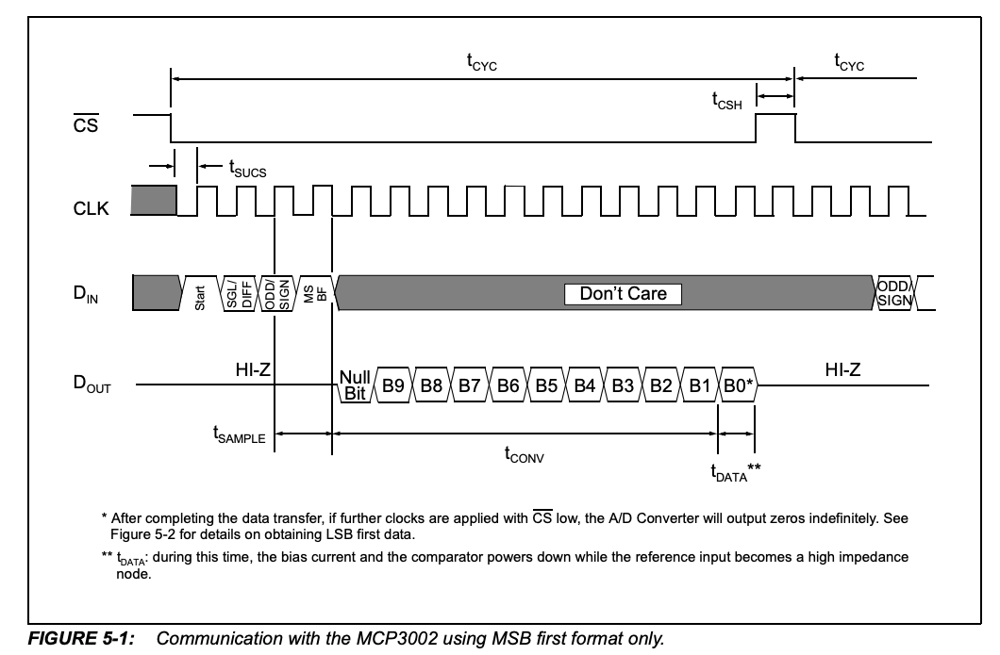
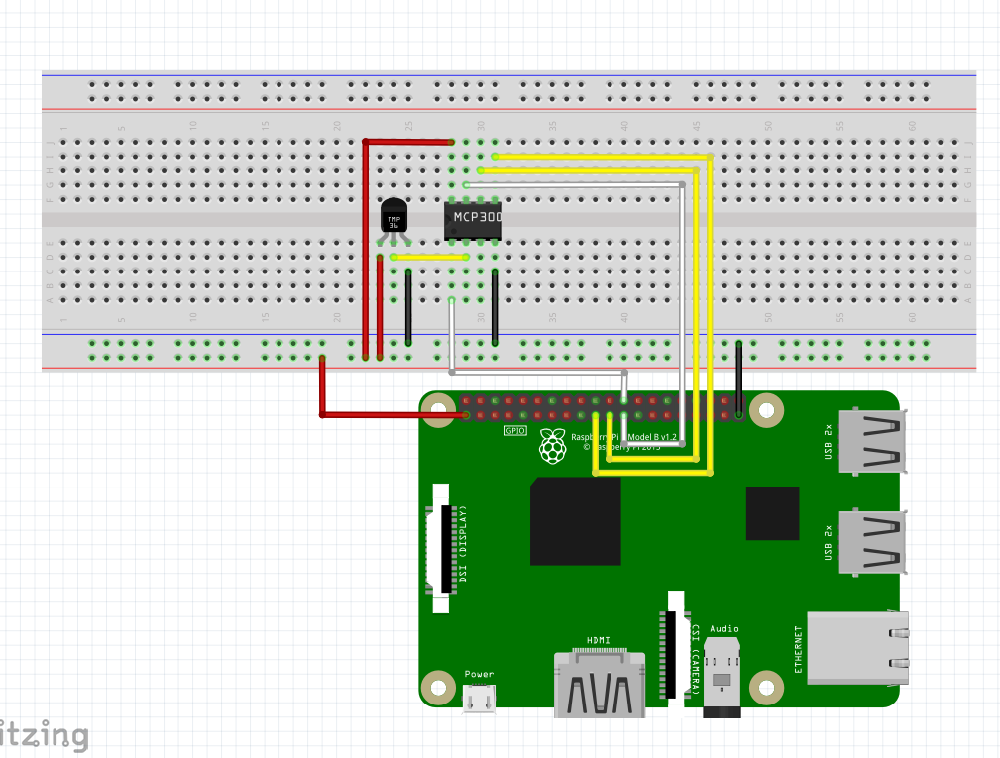

# ■ 作るもの

アナログ温度センサーとA/Dコンバータを利用した室温測定器

# ■ 利用する部品

## MCP3002

10Bit A/Dコンバーター (SPIシリアルインターフェース)

[データシート](https://akizukidenshi.com/download/ds/microchip/mcp3002.pdf)

### 基本情報

### ピン

```
VDD/VREF CLK DOUT DIN
 --------------------
| )  MCP3002        |
 --------------------
CS/SHDN  CH0 CH1  VSS
```

1. CS/SHDN :ラズパイのCE0(CE1)端子に接続  
    - 通信時にMCP3002からラズパイのCE0(CE1)端子をLOWに設定する
1. CH0: アナログデバイスの出力端子に接続  
    - アナログデバイスの出力電圧を受け取る
1. CH1: アナログデバイスの出力端子に接続  
    - アナログデバイスの出力電圧を受け取る  
1. VSS: ラズパイのGND端子に接続  
1. DIN: ラズパイのMISO(Master In Slave Out)端子に接続  
    - ラズパイからMCP3002へのデータ入力  
1. DOUT: ラズパイのMOSI(Master Out Slave In)端子に接続  
    - MCP3002からラズパイへのデータ入力  
1. CLK: ラズパイのSCKL(シリアルクロック)端子に接続  
    - 通信するデバイス同士のタイミング合わせで利用
1. VDD/VREF: ラズパイの3.3V端子に接続  
    - 電源/基準電圧入力 (2.7V~5.5V)

### 送信データ

送信データは16ビット

1. 固定で0
2. スタートビット: 1 (固定)
3. SGL/DIFF: 動作モードを選択
    - 0: 擬似差動モード (よくわからん)
    - 1: シングルエンドモード (とりあえず今回はこっち)
4. ODD/SIGN: シングルエンドモードで使用されるチャンネルを選択。
    - 0: CH0 (CH0端子にアナログデバイスを接続している場合はこちら)
    - 1: CH1 (CH1端子にアナログデバイスを接続している場合はこちら)
5. MSBF: 受信データのフォーマットを選択。
    - 0: MCP3002はMSBファーストフォーマット(最上位ビットから)で送信
    - 1: MCP3002はMSBファーストフォーマットで送信した後、LSBファーストフォーマット(最下位ビットから)に変換された値を送信
6. 以降すべて0

#### MSBファーストフォーマットのみ利用するする場合のデータの送受信




## LM61CIZ

温度センサー

[データシート](https://www.ti.com/jp/lit/ds/symlink/lm61.pdf)

### 基本情報

- 動作温度範囲: -30℃ ~ 100℃
- 電源電圧: 2.7V ~ 10V
- 消費電力: 125μA (最大値)
- 出力電圧: 600mVを0℃として、1℃あたり10mVの増減
  - -30℃: 300mV
  - 0℃: 600mV
  - 100℃: 1600mV

### ピン


```
*** 下から見た図 ***

 -----------------
|                 |
|  +VS  VOUT GND  |
|  ---  ---  ---  |
 \               /
  \             /
   \           /
    \_________/
```           


1. +VS: ラズパイの3.3V端子に接続
    - 電源入力 (2.7V~10V)
1. VOUT: A/Dコンバータのアナログインプット端子に接続
    - 温度センサーのアナログアウトプット(300mV(-30℃)~1600mV(100℃))
1. GND: ラズパイのGND端子に接続

# 回路図


